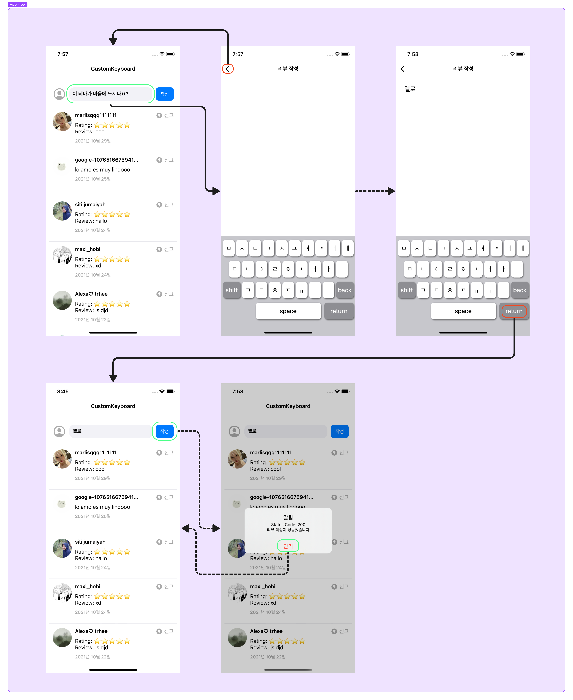
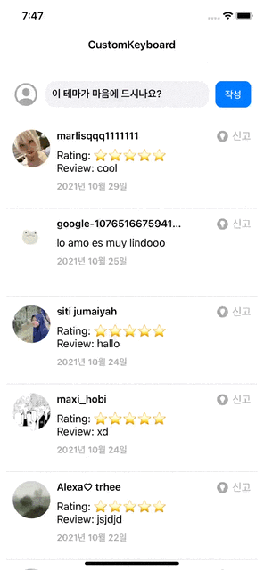
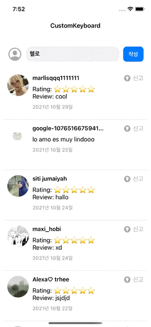
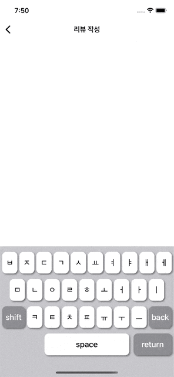
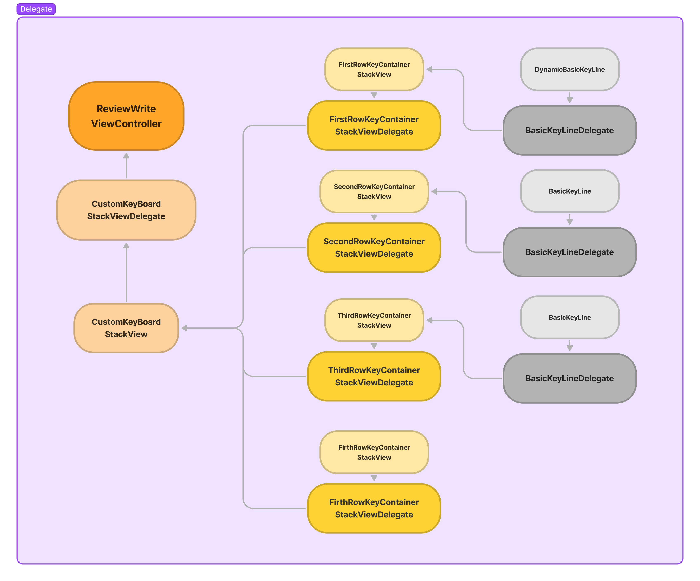

# 원티드 iOS 프리온보딩(with 야곰아카데미) -  ⌨ CustomKeyboard App

## 개발 환경
  - xcode : Version 13.4.1 (13F100)
  - deployment Target : 14.0
 
# 목차
  1. [Team](#Team)
     1. [팀원 소개](#팀원-소개)
     2. [기여한 부분](#기여한-부분)
  2. [프로젝트 소개](#프로젝트-소개)
     1. [목표](#목표)
     2. [사용한 기술](#사용한-기술)
     3. [기능 소개](#기능-소개)
        - [App Flow](#App-Flow)
        - [Demo gif](#Demo-gif)
     4. [사용한 Pattern 소개](#사용한-Pattern-소개)
        - [MVVM Pattern](#MVVM-Pattern)
        - [Delegate Pattern](#Delegate-Pattern)
     5. [객체 역할 소개](#객체-역할-소개)
        - [View 관련](#View-관련)
        - [Manger 관련](#Manger-관련)
  3. [고민한 부분](#고민한-부분)
  4. [회고](회고)
  
---

# Team
## 팀원 소개 

| 오얏                       | 커킴                            | 
| ---------------------------- | -------------------------------- |
| [](https://github.com/iclxxud)|[](https://github.com/kirkim)|
| 개발 및 팀 자료 제작 | 개발 및 앱 Bug 탐색 |

## 기여한 부분

| 팀원 | 기여한 내용|
| ---------------------------- | -------------------------------- |
| 오얏 |- ReviewListView UI 및 기능 구현 <br />- Network ReviewType CodingKeys 적용 <br />- 코드 리팩토링 및 앱 기본 타겟 설정 <br />- KeyBoardEngine 기능 구현 <br />- CustomKeyBoardStackViewViewModel, CustomKeyBoard 테스트코드 구현|
| 커킴 |- NetworkManager 기능 구현 <br />- ReviewWriteView UI 및 기능 구현 <br />- CustomKeyBoardStackView UI 및 기능 구현(MVVM, Delegate패턴) <br />- Unicode열거형타입(Initial, Neutral, Support, CharUnicode) 구현 <br />- KeyBoardEngine 기능 구현 <br />- CustomKeyBoardStackViewViewModel, CustomKeyBoard 테스트코드 구현|

# 프로젝트 소개

## 목표
> 서버 API를 이용하여 리뷰 목록을 가져오고, 새로운 리뷰를 작성하는 커스텀 키보드 App    
> 화면에 키보드 자판 버튼들을 배치해서, 누르면 한글 키보드처럼 조합되는 한글 쿼티 화면을 구현합니다.
> 아이폰, 세로 모드만 지원하는 앱입니다.

## 사용한 기술
`MVVM Pattern` `Delegate Pattern` `Code-based UI` `NSCache` `XCTest`
  
## 기능 소개

### App Flow

  <p float="none">
  
  </p>

### Demo Gif
  - ReviewList 메인 화면

 <p float="left">
  
</p>

 - ReviewList 작성 버튼 알림창

    <p float="left">
  
</p>

  - ReviewWrite 키보드 기능
  
   <p float="left">
  
</p>

## 사용한 Pattern 소개
### MVVM Pattern
### 1. MVVM 패턴을 사용한 이유
>- 이번프로젝트에서 다음과 같이 두곳에서 MVVM패턴을 사용했습니다.
    - ReviewListViewController(첫페이지)
    - CustomKeyBoardStackView(커스텀키보드)
>- 이번 프로젝트의 첫페이지는 네트워크로부터 데이터를 받아와 UI를 표시해주는 화면입니다. 추가로 Post요청이 필요한 전송버튼 이벤트도 있습니다. 심지어 네트워크로 부터 받은데이터를 적절히 셀데이터로 가공하는 과정도 필요합니다. 만약 MVC패턴을 이용하게된다면 ViewController의 역할이 너무 많아지고 코드길이도 너무 길어질 것입니다. 대신에 뷰와 네트워크매니저의 상호작용 사이에 ViewModel을 만들어 중간에서 이벤트를 받고 적절한 UI데이터로 가공해주는 역할을 하도록 한다면 좀 더 코드를 깔끔하게 구현할 수 있습니다.
>- 다음으로 사용된 CustomKeyBoardStackView(커스텀키보드)는 컨테이너를 4개로 쪼갤만큼 UI적으로 규모가 있었습니다. 키보드만큼은 기능적으로 확실히 분리할 필요가 있었습니다.
>- 이처럼 MVVM 패턴을 이용하면 UI, 이벤트, 데이터모델 세가지의 일을 명확히 나누어 처리할 수 있습니다. 이는 코드를 훨씬 깔끔하게 만들어주고 유지보수 또한 좋게 해줍니다. 또한 이벤트 전달과 데이터 전달과정이 단방향으로 이루어지기 때문에 이벤트의 로직흐름을 쉽게 파악할 수 있는 장점이 있습니다.

### 2. 사용한 곳
1. ReviewListViewController ← → ReviewListViewModel ← → NetworkManager
    - ReviewListviewController의 역할
        - 리뷰입력창의 입력이벤트를 사용자로부터 받음
        - 리뷰 전송버튼 클릭이벤트를 사용자로부터 받음
        - ReviewListViewModel로 받은 셀데이터를 이용하여 콜렉션뷰 UI를 만듬
    - ReviewListViewModel
        - ReviewListviewController로 부터 리뷰전송버튼 클릭이벤트를 전달받아 NetworkManager에 리뷰Post를 요청함
        - ReviewListviewController로 부터 셀데이터를 요청받으면 NetworkManager로 부터 ReviewType데이터를 요청하여 받고 ReviewType데이터를 셀데이터에 맞게 가공하여 ReviewListviewController로 다시 전달해줌
2. CustomKeyBoardStackView ← → CustomKeyBoardStackViewViewModel, KeyBoardEngineProtocol
    
    이번의 구조는 Model이 없는 MVVM패턴입니다. KeyBoardEngineProtocol는 Model이기 보다는 ViewModel의 역할을 구체적으로 도와주는 역할을 하도록 구현했습니다.
    
    - CustomKeyBoardStackView의 역할
        - 커스텀키보드의 UI를 만듬
        - 키보드의 버튼클릭 이벤트를 사용자로부터 받아 CustomKeyBoardStackViewViewModel로 전달해줌
    - CustomKeyBoardStackViewViewModel의 역할
        - CustomKeyBoardStackView로 부터 전달받은 버튼클릭 이벤트를 add, space, remove로 구분하여 처리하고 처리된 후의 데이터를 다시 CustomKeyBoardStackView로 전달해줍니다.
    - KeyBoardEngineProtocol의 역할
        - CustomKeyBoardStackViewViewModel에서 add, space, remove의 이벤트를 포괄적으로 받아왔다면, KeyBoardEngineProtocol은 이 이벤트들을 좀더 구체적으로 처리하여 CustomKeyBoardStackViewViewModel를 도와주는 역할을 합니다.

### Delegate Pattern

<p float="none">
  
  </p>

  
### 1. 딜리게이트 패턴을 사용한 이유
> - Notification은 연결고리를 직접이어줄 필요없이 키값으로 연결할 수 있지만 그만큼 추적하기가 힘들고 메모리도 직접관리해줘야하기 때문에 관리하기가 힘듭니다. 반면 Delegate패턴을 사용하면 다음의 장점이 있습니다.
>>    1. 뷰를 여러개로 쪼개어도 각각의 서브뷰들의 이벤트를 관리하고 추적하기가 쉽다.
>>    2. 명확한 메서드명으로 어떤 역할을 하는지 알기 쉽다.
>>    3.  필요한 메서드를 강제로 구현하도록 만들 수 있어 실수를 방지할 수 있다.
>>    4.  1대1로 직접연결되어 있기 때문에 이벤트의 추가와 삭제가 쉽고 간편합니다. 추가로 이벤트의 전달과정을 파악하기 쉽습니다.
### 2. 어떤 장점이 존재할까?
 1. CustomKeyBoardStackViewDelegate
- 커스텀 키보드에 UITextView를 연결
- FirthRowKeyContainerStackView에서 전달받은 Return버튼의 클릭이벤트를 전달
2. FirstRowKeyContainerStackViewDelegate
- DynamicBasicKeyLine에서 전달받은 기본버튼 클릭이벤트를 전달
3. SecondRowKeyContainerStackViewDelegate
- BasicKeyLine에서 전달받은 기본버튼 클릭이벤트를 전달
4. ThirdRowKeyContainerStackViewDelegate
- BasicKeyLine에서 전달받은 기본버튼 클릭이벤트를 전달
- Shift버튼의 클릭이벤트를 전달
- Back버튼의 클릭이벤트를 전달
5. FirthRowKeyContainerStackViewDelegate
- Space버튼의 클릭이벤트를 전달
- Return버튼의 클릭이벤트를 전달

## 객체 역할 소개

### View 관련

| class / struct               | 역할                                                         |
| ---------------------------- | ------------------------------------------------------------ |
| `SceneDelegate`         | - 윈도우초기화 및 앱의 초기 권한 요청, 첫페이지 연결  |
| `ReviewListView`           | - 요청받아온 리뷰목록을 표시한다. <br />- 입력한 리뷰를 POST요청할 수 있다. |
| `ReviewWriteView`            | - 키보드로 입력된 값을 실시간으로 출력하여 보여준다. <br />- 키보드 return입력시 실시간내용을 ReviewListView로 보내준다. |
| `CustomKeyBoardStackView`            | - 한글쿼티키보드입력, shift, back, space, return 버튼기능을 한다. |

### Manger 관련

| class / struct               | 역할                                                         |
| ---------------------------- | ------------------------------------------------------------ |
| `NetworkManager`         | - 네트워크 통신을 하는 싱글턴 객체입니다. <br />- 제공된API로부터 리뷰목록을 GET요청하여 데이터를 받아온다. <br />- 제공된API로 리뷰를 POST요청하여 응답코드를 받을 수 있다. |
| `KeyboardEngine`      | - 문장의 끝글자와 입력글자의 조합역할을 하는 구조체입니다. <br />- 글자,space 입력시 아이폰의 입력과 동일한 규칙의 조합으로 출력해줍니다. <br />- back버튼 클릭시 글자,space의 입력과 동일한 규칙을 이용해 역방향으로 지워줍니다.<br />&nbsp;&nbsp;(단, ㅓ+ㅣ => ㅔ와 같은 아이폰에만 존재하는 규칙은 한번에 지워줌) |

# 고민한 부분
## 오얏
### 1. CollectionViewCell protocol로 더나은 재사용 식별자 사용하기

cell부분을 protocol로 적용해볼 수도 있다는 피드백을 받고 고민하고 적용해보았습니다.

- 1차원적으로 사용하는 방법 1 : 단순 문자열로 만들기
String으로 받기 때문에 오타라도 난다면... 좋지 못한 방법일 것입니다.

```swift
// in a set up method
collectionView.register(
    CustomCollectionViewCell.self, 
    forCellWithReuseIdentifier: "CustomCollectionViewCell"
)
// in cellForItem(at:)
collectionView.dequeueReusableCell(
    withReuseIdentifier: "CustomCollectionViewCell"
    for: indexPath
)
```

- 좀 더 개선한 방법 2 : 단순 문자열을 static let으로 이동해 만들기
이번 프로젝트에서 사용했고 저번 프로젝트도 이런 식으로 작성을 했었습니다. 근데 찾아보니 이 또한 나중에 문제가 생길 수도 있다고 합니다.

```swift
final class CustomCollectionViewCell: UICollectionViewCell {
    static let reuseIdentifier = "CustomCollectionViewCell"
}
```

- 또 다른 문제 -> 나중에 클래스 이름이 변경된다면?

### 최종 해결 방법
 - 프로토콜로 빼고 extension으로 
```swift
protocol ReuseIdentifying {
    static var reuseIdentifier: String { get }
}

extension ReuseIdentifying {
    static var reuseIdentifier: String {
        return String(describing: Self.self) 
    }
}
```
- 실제 사용 시 extension으로 빼줬긴 때문에 개별적으로 적용할 필요가 사라집니다.

```swift
extension UICollectionViewCell: ReuseIdentifying {}
```

*Self.self
- 문맥에 따라 다른 의미를 갖는다. 
  - protocol 내부에서의 Self 의미: 해당 protocol을 채택한 타입을 의미
  - Class에서의 Self 의미:
    - 해당 인스턴스의 타입 자체를 표현
    - 메소드 시그니처에서 결과값으로만 사용 가능
    - 메소드 몸체에는 사용 불가
- Self는 type그 자체를 의미: 타입을 정의할때 사용
- Self.self는 type object를 의미: 타입을 넘길때 사용

[참고자료](https://medium.com/bleeding-edge/nicer-reuse-identifiers-with-protocols-in-swift-97d18de1b2df)

### 2. Data(contentsOf:)를 사용하면 안되는 이유

ReviewListView의 API로 부터 받아온 이미지 데이터를 로드하기 위해서 초반에 extension으로 아래와 같이 작성했었습니다. 물론 작동은 정상적으로 작동하지만 멘토링으로 `Data(contentOf:)`의 사용하지 않는 것이 되도록 좋고 그대로 사용한다면 사용하는 이유가 있는지 피드백을 받게 되었다.

- 정상적으로 작동하는데 왜 사용하면 안될까? 
`DispatchQueue.global().async`로 감싸주어 스레드 문제는 해결되었지만 권장하지 않는다.
먼저 main스레드를 멈추는 문제는 해결했지만 여전히 GCD의 제한된 작업 스레드 중 하나를 묶는 셈이 된다.
이는 직접적이진 않아도 간접적으로 성능에 영향을 준다.
또한 URLSession과 달리 작업에 대한 의미 있는 진단을 수행할 수 없다.
URLSession에서는 오류가 네트워크 오류인지, HTTP오류인지, Contents오류인지 등을 판별할 수 있지만 Data(contentsOf:)는 이를 확인이 불가하다.

애플 공식문서에서는 `contentsOf: url` 자체가 동기식이고 네트워크 기반 URL의 경우 느린 네트워크에서 수십 초 당안 현재 스레드를 차단해 사용자 경험을 저하시키고 iOS에서는 앱이 종료될 수 있음으로 파일이 아닌 URL의 경우 URLSession 클래스의 dataTask(with:completionHandler:) 메서드를 사용하는 것을 권장합니다.

핵심은 `Data(contentOf: url)`는 기본적으로 동기적으로 즉 순차적으로 작동하는 아이임으로 억지로 `DispatchQueue.global().async`를 감싸서 백그라운드 스레드에서 비동기로 작동 시키는 것을 애플에서는 dataTask(with:completionHandler:) 메서드로 `contentOf: url` 메서드를 대체하길 바라는 거죠. dataTask를 씀으로 1.간접적인 성능 문제 해결과 2.오류 판별의 이점을 확보할 수 있게 됩니다.

```swift
//변경 전
extension UIImageView {
    func load(url: URL) {
        DispatchQueue.global().async { [weak self] in
            if let data = try? Data(contentsOf: url) {
                if let image = UIImage(data: data) {
                    DispatchQueue.main.async {
                        self?.image = image
                    }
                }
            }
        }
    }
}
```

```swift
//변경 후
extension UIImageView {
    func load(url: URL) {
        URLSession.shared.dataTask(with: url) { data, response, error in
            guard
                let data = data, error == nil,
                let image = UIImage(data: data)
                else { return }
            DispatchQueue.main.async() { [weak self] in
                self?.image = image
            }
        }.resume()
    }
}
```

[참고자료1](https://developer.apple.com/documentation/foundation/nsdata/1413892-init)\
[참고자료2](https://inuplace.tistory.com/1230)


## 커킴

### 키보드UI:

키보드UI를 iphone-touch7부터 imax13proMax까지 자연스러운UI로 나오게끔 만들고자 노력했습니다.

처음에 기본버튼(ㄱ, ㄴ, ㄷ…)을 한줄씩 담는 클래스를 제외하고 나머지 버튼들은 따로 클래스를 만들지 않고 `CustomKeyBoard`안에 담아줬습니다.  어찌어찌해서 구현했지만 생각보다 layout(레이아웃)을 구성하는 코드들이 너무 복잡했습니다.  무엇보다 오토레이아웃을 위해 존재하는 각종 보정값들이 뒤엉켜 있었는데, 나중에 버튼크기를 1px를 조정해주기도 힘들어 보였습니다. 당연히 새로운키를 추가하는 것도 힘들어 보였습니다.

이것을 보완하기 위해 UIStackView의 계층구조별로 컴포넌트들을 쪼개서 새로운 클래스로 만들어 줬습니다. 결론적으로 커스텀키보드를 Vertical UIStackVIew로 만들고 4개의 Horizontal UIStackVIew의 서브컴포넌트로 쪼개어 구성해줬습니다. 이벤트를 위한 delegate도 각각의 서브컴포넌트별로 나눠줬습니다.

이로써 행,열의 새로운버튼을 추가하기가 쉬워지고 이벤트기능추가도 좀 더 쉬워질 것 같습니다.

### 키보드엔진1 - 알고리즘구현:

저희 팀원은 키보드엔진을 만들어 키보드입력값에 대해 처리해주도록 했습니다. 먼저 `기존문장의 마지막글자`와 `키보드입력값`을 기본 인자로 놓고 알고리즘을 구상하였습니다.

성능에 초점을 두고 알고리즘을 작성할 수 있지만, 먼저 유니코드와 친해질겸 가독성에 초점을 두고 알고리즘을 작성했습니다.

먼저 조합되는 방법의 갯수는 `기존문장의 마지막글자 종류` x `키보드입력값의 종류` 만큼 나올 것입니다. 결국 각파트의 종류를 어떻게 분류하느냐에 따라 작성하는 코드의량이 달라질 것 입니다.

이 점에서 어떻게하면 각파트의 종류를 효율적으로 분류할 수 있을까에 대해 고민을 많이 했던 것 같습니다.

### 키보드엔진2 - enum타입만들기

유니코드는 같은 글자라도 초성, 중성, 종성에 따라서 다른순번을 가지게 됩니다. 또한 자음, 모음 단독으로 존재했을때도 순번이 달라집니다. 모음의 경우 단독, 중성에 위치했을때 순번이 모두 같지만, 자음의 경우 초성, 종성, 단독으로 존재했을때 모두 순번이 달라졌습니다.

결론적으로 다음과 같이 네임스페이스용으로 enum타입을 만들어 줬습니다.

- 초성 ⇒ Initial
- 중성 ⇒ Neutral
- 종성 ⇒ Support
- 단독글자 ⇒ CharUnicode

그냥 순수하게 유니코드의 Int값을 작성하기 보다는 위에서 만들어준 enum타입의 케이스들을 호출하는 식으로 코드를 구현했습니다.

확실히 유니코드를 일리리 찾아서 작성할 필요가 없어 코드작성이 수월해졌고, 무엇보다 가독성이 좋아졌습니다. 하지만 순수Int값대신 Enum case의 rawValue값을 호출해오는 방식이 성능이나 메모리에 안좋은 영향을 끼치지 않을까 고민했습니다.

### 키보드엔진3 - enum case VS enum static let

이번 고민은 enum을 네임스페이스용으로 사용할 것을 확정하고 고민한 내용입니다. case로 네임스페이스를 만들면 값을 호출하기 위해 `.rawValue` 를 붙여야 합니다. 반면 static let으로 구현한다면 간단히 enum.변수에 접근하여 값을 호출할 수 있습니다. 성능면에서 차이가 없다면 당연히 static let을 사용하여 네임스페이스를 구현하는 것이 더 깔끔할 것입니다. 하지만 구현당시에 어떤방법이 더 좋은 방법인지 판단할 수 있는 능력이 없어서 고민을 했습니다.

# 회고
## 오얏
1. 전체회고

두번째 팀 프로젝트이자 원티드 프리온보딩 기간 중 마지막 팀프로젝트를 진행하며 아직 많이 부족하고 배울 게 정말 많구나 라는 생각이 들었습니다.
이번 프로젝트로 더 많이 배우고 노력해야겠다는 생각을 했고 한편으로는 멘탈적으로 많이 부셔졌던 첫번째 팀 프로젝트에 비해 여유를 갖고 진행할 수 있었던 것 같습니다.
사용해보지 못했던 기술들을 사용해보고 익숙하지 않던 개념들에 대해 알게 되고 정리가 더 필요하지만 정말 짧은 시간 많은 성장을 하게 되지 않았나 생각하게 됩니다.
아마도 혼자서 했다면 이렇게까지 해보는 건 쉽지 않았을 거란 생각이 듭니다. 물론 현재도 많이 부족해 힘들지만 아직 제대로 한 건 한달 정도이니 너무 기죽지 말고
욕심 부리지 말고 남과 비교하지 말고 어제보다 더 성장하는 오늘의 내가 되기 위해 노력해야겠습니다.

2. 기술

MVC를 MVVM으로 라이브로 리팩토링해보고 컴포지셔널 레이아웃도 구현해보고 물론 컴포지셔널에 경우 조금은 사용하면서도 굳이 라는 생각도 들었지만 사용해보지 않던 기술에 개념에 대해 어느정도 확립할 수 있어 좋은 시간이 되었던 것 같습니다. 키보드 구현의 경우 알고리즘적으로 초반에 리스트뷰를 너무 신경쓴 나머지 프로젝트 중간부터 이해하게 되었는데 나름 처음 해보는 유닛테스트도 해보고 알고리즘적으로도 이해하고 넘어갈 수 있어서 다행이라고 생각한다. 구현에 있어서 좀 더 어떻게 하면 효율적으로 구현할 수 있을까에 대한 부분은 좀 더 봐야겠지만 팀원 덕분에 많은 것을 배울 수 있었다.

3. 협업

깃 사용은 매번 새롭게 헷갈리지만 나름 문제 없이 진행되었고 코드 컨벤션에 대한 걸 나름 초반에 정했음에도 완벽히 이행하지 않은 부분이 마지막쯤 가서 진행하게 되었더니 파일들도 확장됨에 따라 많은 시간을 할애하게 되었습니다. 다시 한번 코드 컨벤션의 중요성을 깨달았고 이런 실수를 최대한 줄이기 위해 노력해야겠다고 생각했습니다. 시작할 때쯤엔 코드리뷰도 진행해보면 어떨까 싶었는데 이 부분도 실행하지 못해서 아쉬움이 남지만 그래도 이슈를 세분화해서 커밋하는 습관을 해보면서 나름 체계적으로 개발할 수 있었던 것 같습니다. 이슈 작성에 좀 노력을 하게 되면 현재 내가 무엇을 해야하고 어디 위치에 있는가에 대해 논리적으로 한 번 생각해볼 수 있어 협업에 있어서는 이슈와 컨벤션을 위해서라도 팀원과의 많은 소통이 초반에 있어야 한다는 것을 깨달았고 좀 더 성장할 수 있는 시간이 되었던 것 같습니다.

## 커킴

이번에 팀프로젝트를 진행하면서 많은 것을 배울 수 있었던 것 같습니다.

1. 나에게 가독성이 좋아보여도 남에게는 가독성이 나빠보일 수 있다.
    
    ⇒ 자신의 코드는 자기가 짰기때문에 가독성을 객관적으로 판단하기 어려울 수 있습니다. 이번에 상대방의 관점에서 가독성이 어떤점에서 나빠질 수 있는지 알게 되었고 좀 더 신경쓰게된 계기가 됐습니다. 코드의 기술적인 부분뿐만아니라 좀 더 가독성 좋은 코드를 짜고 싶다면 좀 더 다양한 사람들과 팀프로젝트를 해보며 다양한 코드를 경험해보는 것이 무엇보다 중요하다고 생각했습니다.
    
2. 코드 컨벤션은 기획단계에서 최대한 구상하자
    
    ⇒ 막판에 각자의 스타일대로 코드를 구현부분을 통일하는 과정에서 시간이 생각보다 오래 걸렸던 것 같습니다. 만약 프로젝트가 더 컸더라면 더 시간이 오래걸렸을 것입니다.
    
3. 깃허브의 이슈를 잘 활용하고, 이슈를 최대한 쪼개어 만들자.
    
    ⇒ 혼자서 코드를 작성할때는 코드리뷰가 필요없기 때문에 하루 단위로 커밋을하여 깃허브에 push했던 것 같습니다.
    
    이번에 고맙게도 팀원으로부터 깃허브이슈에 대해 배우게 됐고, 이슈를 먼저 구상하고 코드를 구현하는 식으로 진행하였는데, 덕분에 코드를 작성하는데 있어서 체계적으로 바뀌었고 여태껏 어떤 코드를 작성했는지 코드를 리뷰하는 것이 매우 편해졌습니다. 이제는 깃허브이슈를 사용하는 것이 협업에 있어서 매우 중요하다고 생각이 들게 되었습니다. 심지어 개인프로젝트를 진행할 때도 깃허브이슈를 활용할 계획입니다. 개인적으로 이번프로젝트의 가장 큰 수확은 깃허브이슈의 활용이 아닐까 생각이 듭니다.
    
4. 테스트코드의 중요성
    
    ⇒ 개인적으로 이번 프로젝트에서 처음 테스트코드를 배우고 활용해봤습니다. 이번 프로젝트가 테스트코드를 연습하기에 가장 좋은 프로젝트이지 않았나 생각이 듭니다. 이번에 100개가 넘는 테스트코드를 작성했는데, 처음에 작성은 힘들었지만, 결과적으로 코드의 버그 수정과 리펙토링에 있어서 시간을 줄여주는 역할을 했던 것 같습니다. 프리온보딩 야곰아카데미수업에서 이론으로 배웠던 테스트코드를 직접 사용하면서 테스트코드의 이점과 왜 First규칙을 따라야하는지 대해서 몸으로 느낄 수 있었던 계기가 된 것 같습니다.
    
5. 항상꼼꼼하게
    
    ⇒ 기존에 이것쯤이야 하는 생각으로 코드를 작성하거나 문서를 정리하였습니다. 반면 이번의 팀원인 오얏님이 회의, 컨벤션 전략, git flow전략, 리드미 등등 꼼꼼하게 정리해주셨고 코드를 같이 정리할때도 꼼꼼하게 정리하셨던 것 같습니다, 이점에서 다시한번 태도에 대해서 생각하는 계기가 되었습니다. 앱개발자 특성상 유저와 제일근접하기 때문에 꼼꼼한 것이 더 중요하다고 생각합니다. 앞으로 1px에도 예민하게 반응하는 꼼꼼한 앱개발자가 되도록 노력해야겠습니다.
